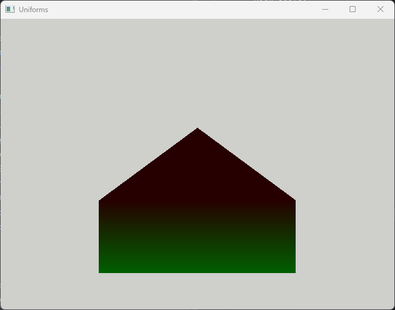
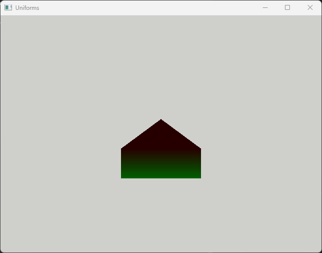
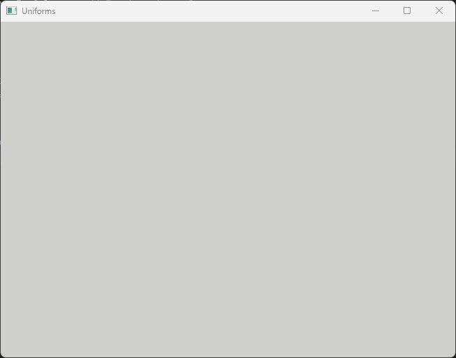

# Sprawozdanie z ćwiczenia

---
>## Modyfikacja Koloru Piksela
>> W ramach tej modyfikacji zaimplementowano mechanizm modyfikacji koloru piksela w fragment shaderze za pomocą danych przechowywanych w bloku jednorodnym.
> Proces ten wymagał szeregu kroków, włączając w to utworzenie interfejsu bloku jednorodnego w shaderze,
> stworzenie i przypisanie bufora jednorodnego w kodzie C++ oraz wykorzystanie danych z bufora do modyfikacji koloru piksela we fragment shaderze.

>1. Utworzenie Interfejsu Bloku Jednorodnego w Shaderze Fragmentów
>> W pliku shadera base_fs.glsl zdefiniowano interfejs bloku jednorodnego, zawierającego zmienne strength typu float oraz color typu vec3 (trójwymiarowy wektor)

>2. Tworzenie i Przypisanie Bufora Jednorodnego
>> W metodzie init() stworzono bufor jednorodny i przypisano go do interfejsu bloku w shaderze.
Zaalokowano pamięć dla bufora jednorodnego odpowiednio dla zmiennej strength i color.
W metodzie updateBuffer() zaimplementowano mechanizm aktualizacji danych w buforze jednorodnym z nowymi wartościami dla strength i color.

>3. Modyfikacja Koloru Piksela w Fragment Shaderze
>> Zmodyfikowano kod shadera, wykorzystując zmienne z bufora jednorodnego do manipulacji jedynie składowymi RGB koloru piksela.
W shaderze, przy użyciu danych z bufora jednorodnego, pomnożono wartości RGB piksela przez strength i color, zachowując stałą wartość alfa.

---

>## Przenoszenie domów :)
>> Ćwiczenie miało na celu przekształcenie i manipulację kształtami przy użyciu shaderów w OpenGL.
> W ramach tego procesu dokonano transformacji wierzchołków figury, wykorzystując różne macierze transformacji, jak translacja, skalowanie czy rotacja.

>1. Definiowanie Bloku Jednorodnego w Shaderze Wierzchołków
>> W pliku shadera base_vs.glsl zdefiniowano blok jednorodny Transformations, zawierający zmienne typu vec2 (skala), vec2 (translacja) i mat2 (rotacja).

>2. Tworzenie i Przypisanie Bufora Jednorodnego
>> W metodzie init() utworzono bufor jednorodny oraz przypisano go do interfejsu bloku w shaderze.
> Zaalokowano pamięć dla bufora jednorodnego, odpowiednio dla zmiennych dotyczących transformacji: scale, translation i rotation.
> Następnie zaimplementowano mechanizm ładowania danych do bufora jednorodnego, zapewniając zgodność z regułami std140 layout.

>3. Transformacja Wierzchołków w Shaderze Wierzchołków
>> Wykorzystując bufor jednorodny, przekształcono wierzchołki figury w shaderze wierzchołków.
> Transformacja obejmowała kolejno: translację, skalowanie i rotację wierzchołków, zgodnie z zadanymi wartościami dla poszczególnych macierzy transformacji.

>4. Odpowiedź na pytanie z ppkt.2
>>Aby obliczyć liczbę bajtów wymaganą do alokacji bufora, musimy wziąć pod uwagę rozmiar każdej zmiennej w bloku jednorodnym zgodnie z regułami układu std140:
>
>**Rozmiar** ``vec2 scale;``
>
>>2 * sizeof(float) = 2 * 4 bajty = 8 bajtów
>
>**Rozmiar** ``vec2 translation;``
>
>>2 * sizeof(float) = 2 * 4 bajty = 8 bajtów
>
>**Rozmiar** ``mat2 rotation;``
>
>>2 * vec2 (każdy vec2 wyrównany do 8 bajtów) = 2 * 2 * 4 bajty = 16 bajtów
>
>Łączna liczba bajtów wymaganych do alokacji bloku jednorodnego:
>>8 bajtów (skala) + 8 bajtów (przesunięcie) + 16 bajtów (obrót) = 32 bajty


## Napotkane problemy i ich rozwiązania

>1. Błąd w Dostępie do Kanału Alfa
>> **Opis:** Podczas próby dostępu do kanału alfa zmiennej FragColor, występował błąd, który skutkował niepowodzeniem kompilacji.
>````
>Fragment shader
> compilation error: 0(13) : error C1031: swizzle mask element not present in operand "a"
>0(13) : error C1068: array index out of bounds
>
>Invalid program
>````
> **Rozwiązanie:** Zaktualizowano kod shadera, ustawiając jawnie wartość alfa wyjściowego koloru FragColorOut na 1.0, ignorując manipulację kanałem alfa.

>2. Błąd w Użyciu Layout Qualifier 'binding'
>> **Opis:** Błąd związany z użyciem kwalifikatora 'binding' w shaderze fragmentów, który nie był obsługiwany w wersji GLSL.
>````
>Fragment shader
> compilation error: 0(10) : error C7532: layout qualifier 'binding' requires "#version 420" or later
>0(10) : error C0000: ... or #extension GL_ARB_shading_language_420pack : enable
>
>Invalid program
>````
> **Rozwiązanie:** Zaktualizowano wersję GLSL w shaderze do wersji 420, obsługującej kwalifikator 'binding'.

>3. Obracanie domem go ukryło
>> **Opis:** Dokonując transformacji krok po kroku zauważono, iż ostatnia transformacja - obrót spowodowała zniknięcie domu.
>
>**Translacja**
> 
>
>
>**+Skalowanie**
> 
>
>
>**+Rotacja**
>
>
>
> **Tymczasowe Rozwiązanie:** Według ćwiczącego poprawnie wykonano kroki ćwiczenia, nie potrafi określić czy wynik jest zamierzony, dlatego wykorzystano przechowywanie wektorów transformacji. Po uruchomieniu wyświetlany jest wynik po wykonaniu 2 z 3 transformacji, a linijka z wykonanym kodem zgodnie z wytycznymi została zakomentowana.